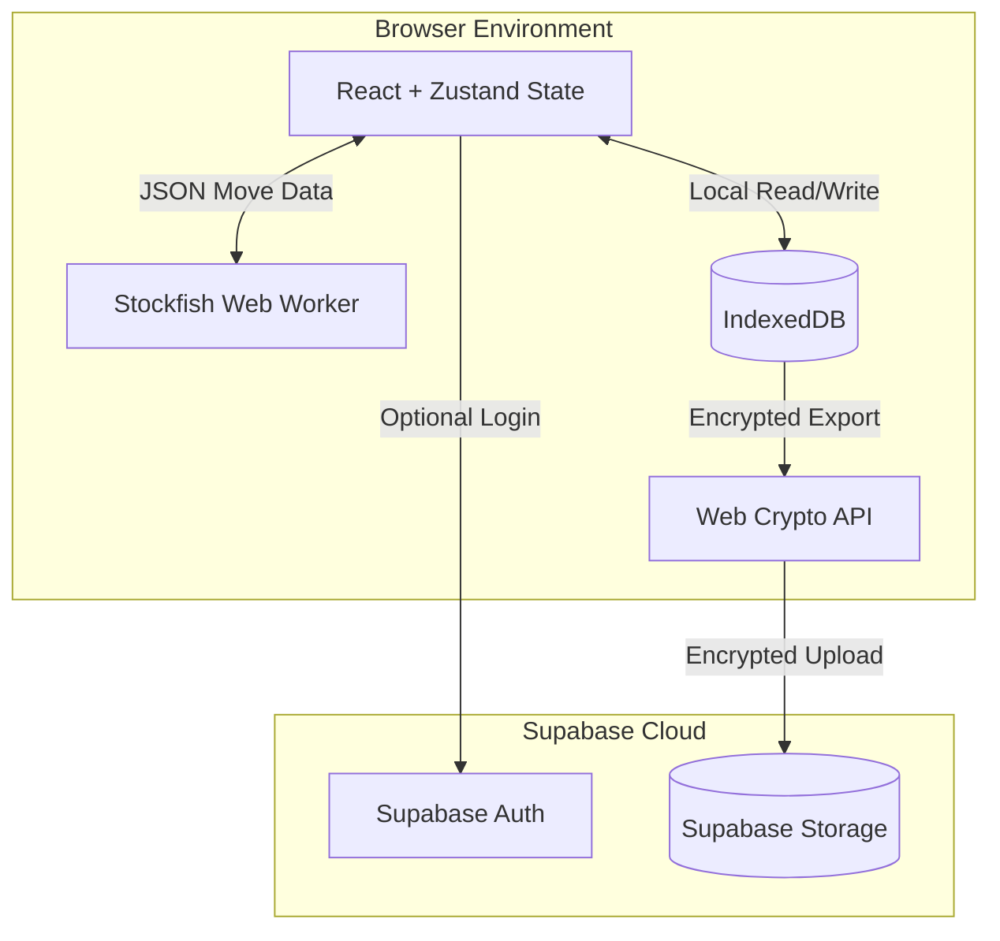

# System Architecture Overview

MIRROR is an offline-first, browser-based Progressive Web App (PWA) built with React, Vite, and TypeScript. Its architecture is explicitly designed to push heavy computational loads (like the Stockfish chess engine) and data storage into the client, maximizing privacy and minimizing server costs.

## System Architecture

## Local-First Data Flow

All progression, analytics, match history, and style vectors are stored locally in **IndexedDB**. The app requires no internet connection to play or save progress.
- Reads and writes are instantaneous and avoid network latency.
- State is modeled into atomic tables (players, matches, analytics, story progress).

## Mirror Engine Flow

1. **Player makes a move** -> The UI records the move and calculates basic metadata.
2. **Post-Match Calibration** -> A background task analyzes the player's game against Stockfish evaluations, extracting a 12-dimensional `StyleVector` (aggression, complexity, endgame preference, etc.).
3. **Playing the Mirror** -> When playing against the "Mirror", the local Stockfish engine generates a MultiPV search. The custom `MirrorOpponent` logic reranks Stockfish's top moves based on their alignment with the player's `StyleVector`.

## Cloud Backup Flow

To ensure data permanence without sacrificing privacy, MIRROR uses an optional, manual cloud backup flow:
1. The entire IndexedDB database is serialized into a structured JSON `MirrorBackupFile`.
2. *(If E2EE is enabled)* The JSON is encrypted locally via the Web Crypto API using AES-GCM and a PBKDF2-derived key from a user passphrase.
3. The resulting (encrypted) blob is uploaded directly to a private Supabase Storage bucket.
4. The user can fetch and decrypt this backup on any device to restore their state.
