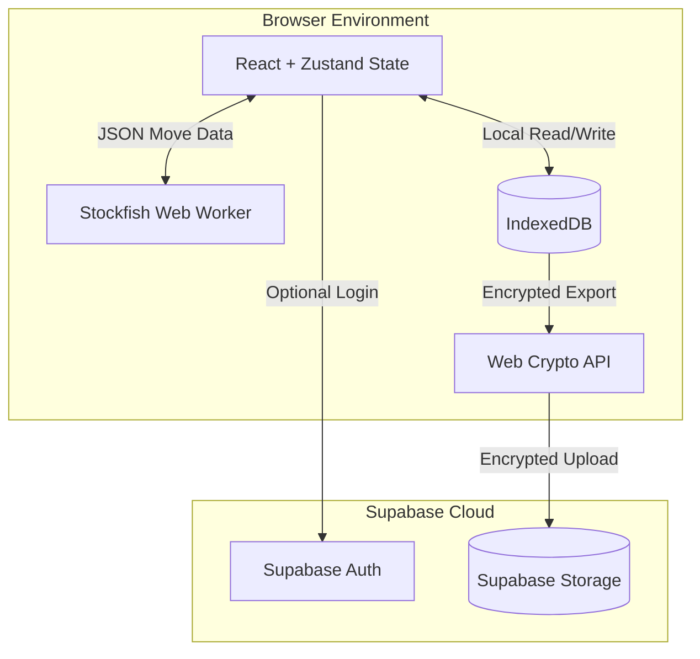

# System Architecture Overview

MIRROR is an offline-first, browser-based Progressive Web App (PWA) built with React, Vite, and TypeScript. Its architecture is explicitly designed to push heavy computational loads (like the Stockfish chess engine) and data storage into the client, maximizing privacy and minimizing server costs.

## System Architecture

## Local-First Data Flow

All progression, analytics, match history, and style vectors are stored locally in **IndexedDB**. The app requires no internet connection to play or save progress.
- Reads and writes are instantaneous and avoid network latency.
- State is modeled into atomic tables (players, matches, analytics, story progress).
- The `/analytics` dashboard reads those local stores directly and emits summary-first Markdown/JSON exports without raw PGN, raw backup JSON, auth tokens, or cloud upload.

## Mirror Engine Flow

1. **Player makes a move** -> The UI records the move and calculates basic metadata.
2. **StyleVector Personalization** -> Calibration task outputs produce the local `StyleVector`. The current code has 11 behavioral/profile fields plus `schema_version` metadata.
3. **Playing the Mirror** -> When playing against the "Mirror", the local Stockfish engine generates a MultiPV search. The custom `MirrorOpponent` logic reranks Stockfish's top moves based on their alignment with the player's `StyleVector`.

## Analytics Dashboard Flow

1. **Local data read** -> `dashboardService` reads `players`, `local_matches`, `mirror_matches`, `imported_games`, `game_reviews`, `saved_analyses`, `clue_attempts`, `puzzle_reviews`, `story_progress`, `achievements`, and `style_vectors` from IndexedDB.
2. **Deterministic aggregation** -> The service computes CP-loss summaries, move-label distribution, StyleVector profile bars, weak motif rows, review queue status, imported-game coverage, Mirror feedback, story/progression state, and data-quality findings.
3. **Action generation** -> `recommendedActions` turns local evidence or insufficient-data findings into prioritized next actions with route targets.
4. **Safe export** -> The route exports `mirror-analytics-dashboard-YYYY-MM-DD.md` and `mirror-analytics-snapshot-YYYY-MM-DD.json` as summaries only. Runtime GenAI and cloud upload are not used.

## Cloud Backup Flow

To ensure data permanence without sacrificing privacy, MIRROR uses an optional, manual cloud backup flow:
1. The entire IndexedDB database is serialized into a structured JSON `MirrorBackupFile`.
2. *(If E2EE is enabled)* The JSON is encrypted locally via the Web Crypto API using AES-GCM and a PBKDF2-derived key from a user passphrase.
3. The resulting (encrypted) blob is uploaded directly to a private Supabase Storage bucket.
4. The user can fetch and decrypt this backup on any device to restore their state.
